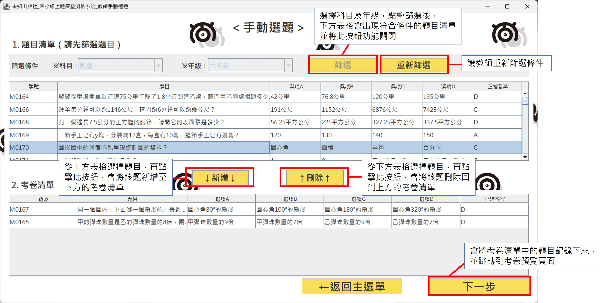
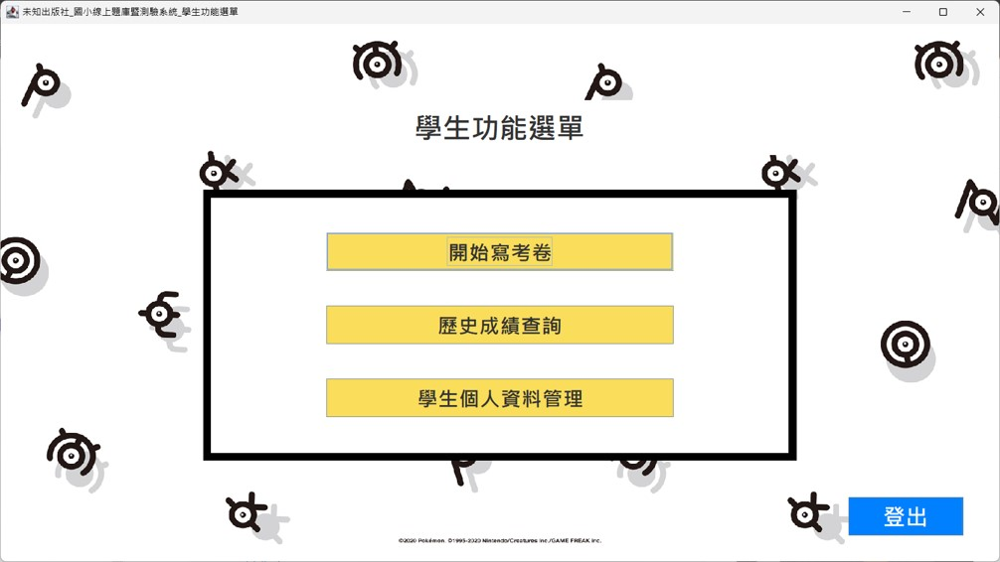

# OnlineTest＜未知出版社＿國小線上題庫暨測驗系統＞
This application allows teachers to create online quizzes for students and enables students to take exams online.   
本程式希望能模擬教師及學生線上出題及作答的系統。 
教師可於系統中製作考卷，並將考卷指定給其所屬學生。 
而學生則可於系統中收到考卷，並直接線上作答。 
教師出題記錄或學生作答紀錄，皆可進行歷史查詢。

## 一、本程式架構

※藍底的表示為教師與學生共用的頁面 
※橘底的表示教師登入後可使用的頁面 
※綠底的表示學生登入後可使用的頁面 
※灰底的表示上個頁面結束後，會與資料庫做的互動內容

## 二、使用說明
### ※教師使用說明

#### 1. **登入：** 
教師請選擇「教師登入」的頁籤，並輸入帳號密碼 
若未註冊過會員，請先選擇「註冊教師帳號」 

  

#### 2. **教師註冊：** 
請教師輸入相關資料以利註冊 
> ※帳號：系統會自動判斷是否有人註冊過此帳號 
> ※密碼：系統會自動判斷是否為英文或數字，且不可含有空白 
> ※確認密碼：系統會自動判斷書入的內容是否與密碼相同 
> ※行動電話：系統會自動判斷格式是否正確 

  

#### 3. **查詢密碼：** 
若曾經註冊過但忘記密碼，可使用帳號及電話號碼查詢密碼。 
查詢成功後，需要重新登入。 

  

#### 4. **教師功能選單：** 
教師登入成功後將會進入功能選單頁面，可執行的功能有： 
(1) [出考卷(電腦出題)](https://github.com/lun880818/OnlineTest/blob/main/README.md#5-%E5%87%BA%E8%80%83%E5%8D%B7%E9%9B%BB%E8%85%A6%E5%87%BA%E9%A1%8C)：若教師希望由電腦隨機選題，則可使用此功能 
(2) [出考卷(手動出題)](https://github.com/lun880818/OnlineTest/blob/main/README.md#6-%E5%87%BA%E8%80%83%E5%8D%B7%E6%89%8B%E5%8B%95%E5%87%BA%E9%A1%8C)：若教師希望由手動選題，則可使用此功能 
(3) [出卷歷史查詢](https://github.com/lun880818/OnlineTest/blob/main/README.md#7-%E5%87%BA%E5%8D%B7%E6%AD%B7%E5%8F%B2%E6%9F%A5%E8%A9%A2)：教師可查詢出過的考卷，若學生還沒作答該卷，也可以刪除考卷 
(4) [個人資料修改](https://github.com/lun880818/OnlineTest/blob/main/README.md#8-%E5%80%8B%E4%BA%BA%E8%B3%87%E6%96%99%E4%BF%AE%E6%94%B9%E5%8F%AF%E4%BF%AE%E6%94%B9%E6%95%99%E5%B8%AB%E5%80%8B%E4%BA%BA%E8%B3%87%E6%96%99)：可修改教師個人資料 

  

#### 5. **出考卷(電腦出題)：** 
若教師希望由電腦隨機選題，則可使用此功能 
(1) 教師須先選擇科目及年級進行篩選，篩過後，系統會顯示符合該條件的考卷總共有幾題。 

  

(2) 教師再選擇希望從中由電腦隨機出的題數，點擊「預覽考卷題目」，將可以查看電腦篩選選出的題目有哪些。 

  

#### 6. **出考卷(手動出題)：** 
若教師希望由手動選題，則可使用此功能 
(1) 教師須先選擇科目及年級進行篩選，篩過後，系統會顯示符合該條件的考卷列表。 
(2) 點選題目清單中的某個題目後，使用「新增」按鈕，可以將該題放入下方的考卷清單中。 
(3) 反之，點選考卷清單中的某個題目後，使用「刪除」按鈕，可以將該題放回題目清單中。 
(4) 點擊「下一步」，進入下一頁繼續輸入其他考卷資訊。 

  

#### 7. **出卷歷史查詢：** 
教師可查詢出過的考卷。 
選擇學生後，下方表格會顯示教師曾經派給該學生哪些考卷。 
若學生未完成該考卷，則教師可刪除該卷。 

  

#### 8. **個人資料修改：**　可修改教師個人資料  

  

### ※學生使用說明

#### 1. **登入：** 
學生請選擇「學生登入」的頁籤，並輸入帳號密碼 
若未註冊過會員，請先選擇「註冊學生帳號」 

  

#### 2. **學生註冊：** 
請學生輸入相關資料以利註冊 
> ※帳號：系統會自動判斷是否有人註冊過此帳號 
> ※密碼：系統會自動判斷是否為英文或數字，且不可含有空白 
> ※確認密碼：系統會自動判斷書入的內容是否與密碼相同 
> ※行動電話：系統會自動判斷格式是否正確 

  

#### 3. **查詢密碼：** 
若曾經註冊過但忘記密碼，可使用帳號及電話號碼查詢密碼。 
查詢成功後，需要重新登入。 

  

#### 4. **學生功能選單：** 
學生登入成功後將會進入功能選單頁面，可執行的功能有： 
(1) 開始寫考卷：進入[學生考卷列表](https://github.com/lun880818/OnlineTest/tree/main?tab=readme-ov-file#5-%E5%AD%B8%E7%94%9F%E8%80%83%E5%8D%B7%E5%88%97%E8%A1%A8))，讓學生選擇考卷進行作答 
(2) 歷史成績查詢：學生可查詢寫過的考卷及成績 
(3) 個人資料修改：可修改學生個人資料 

  

#### 5. **學生考卷列表：** 
將顯示學生還沒作答的考卷列表，選擇某一份考卷，再點擊「開始作答」，將進入[考試頁面](https://github.com/lun880818/OnlineTest/blob/main/README.md#6-%E8%80%83%E8%A9%A6%E9%A0%81%E9%9D%A2)  

  

#### 6. **考試頁面：** 
本頁會顯示題目讓學生作答，若有題目為作答，系統會提醒學生檢查。 

  

#### 7. **歷史成績查詢：** 
學生可查詢寫過的考卷及成績 

  

#### 8. **個人資料修改：**　可修改學生個人資料  

  

## 本程式後續會再精進的功能
1. 新增另一個管理員身分。 
2. 將教師與學生的關係設定交給管理員處理。 
3. 增加題庫的 新增、修改、刪除功能(僅由管理員進行)。 
4. 增加題庫豐富度： 
   科目(例如:社會、自然...等等)、題數擴充。 
5. 篩選題目的條件改由勾選的，讓教師可選擇多個年級，或多個科目，或不同冊別...等等。 
6. 讓教師可以將考卷匯出成excel或pdf。 
7. 學生查詢歷史成績，能再進一步看到當時的作答細節。 
8. 教師查詢出卷紀錄時，若學生已完成該卷，也能進一步看到學生作答細節。 

